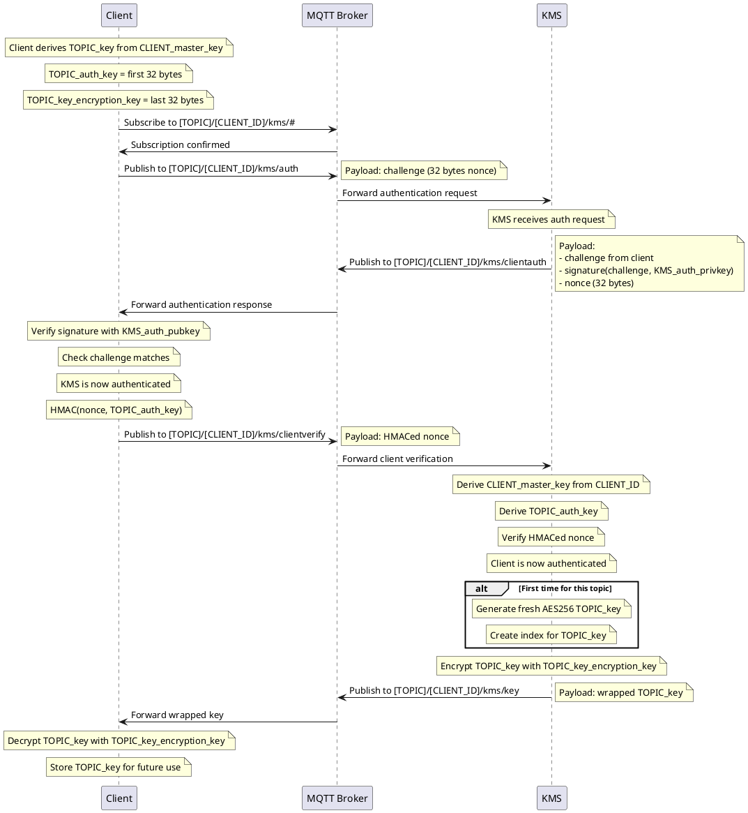

# MQTT Encryption Protocol

This document describes an encryption protocol for MQTT communication between a client and a broker using simple crypto primitives.

## Design Goals
The protocol aims to provide the following security properties:
- mutual authentifcation between producers, subscribers and a Key Management Service (KMS)
- confidentiality of the payload
- integrity and authenticity of the payload
- can interface with any standard MQTT brokers
- the compromise of a single client (aside from the key management server) does not compromise past or future communications (forward and backward secrecy)

## Overview
In order to achieve the above properties, we propose to implement a specific "client", which is responsible for authenticating other clients - both providers and subscribers - and for distributing a shared secret key to encrypt/decrypt the payload. We also propose a way to rotate these keys periodically.

The diagram below shows the components involved in the protocol.

Each MQTT producer can encrypt payloads using topic-specific keys obtained from the Key Management Service (KMS). The MQTT broker acts as a message relay, forwarding encrypted messages to the appropriate subscribers. Each MQTT subscriber retrieves the necessary topic keys from the KMS to decrypt the received payloads.

```
    ┌─────────────────┐                           ┌─────────────────┐
    │  MQTT Producer  │                           │  MQTT Producer  │
    │      #1         │                           │      #2         │
    │                 │                           │                 │
    └─────────┬───────┘                           └─────────┬───────┘
              │                                             │
              │ encrypted                         encrypted │
              │ payloads                          payloads  │
              │                                             │
              ▼                                             ▼
    ┌─────────────────────────────────────────────────────────────────┐
    │                    MQTT Broker                                  │
    │                   (Message Relay)                               │
    │                                                                 │
    └─────────┬───────────────────────────────────┬───────────────────┘
              │                                   │
              │ encrypted messages                │ encrypted messages
              │                                   │
              ▼                                   ▼
    ┌───────────────────────────────┐   ┌─────────────────────────────┐
    │     Key Management Service    │   │      MQTT Subscriber        │
    │   (Producer/Subscriber Client)│   │    (Consuming Client)       │
    │                               │   │                             │
    │ • Authenticates other clients │   │ • Receives encrypted msgs   │
    │ • Distributes topic keys      │   │                             │
    │ • Manages key rotation        │   │ • Decrypts payloads         │
    │ • Handles cert validation     │   │ • Consumes application data │
    │                               │   │                             │
    └───────────────────────────────┘   └─────────────────────────────┘
```

## Key management and key establishment protocols

### Keys

| key | description |
|-----|-------------|
| KMS_auth_pubkey and KMS_auth_privkey | The Key Management Service (KMS) has an RSA or EC key pair (no certificate) known from all other clients. That key is used to prove authenticity of the KMS to other clients, and to sign messages sent by the KMS (like topic key distribution messages). |
| KMS_master_key | A symmetric key (256 bits) known only from the KMS, used to derive per-topic client HMAC keys. |

### CLient master key derivation
A client is provisionned with a key derived from the KMS_master_key.

CLIENT_master_key = HKDF(IKM=KMS_master_key, salt=0, info="[CLIENT_ID]", length=32 bytes)

at client installation time, the client receives:
- the CLIENT_master_key derived as described above
- the KMS_auth_pubkey

### Key Management Service normal operation
Once started, the KMS listens to topics `[TOPIC]/+/kms/#`, ready to receive authentication requests from clients wanting to connect.

When a client connects to the broker, it subscribes to a topic `[TOPIC]/[CLIENT_ID]/kms/#` to receive all topics from the KMS under that client ID.

Then it derives a TOPIC_key for the topic it wants to publish/subscribe to.

- TOPIC_key = HKDF(CLIENT_master_key, salt=0, info="Topic name", length=64 bytes)
- TOPIC_auth_key = first 32 bytes of TOPIC_key
- TOPIC_key_encryption_key = last 32 bytes of TOPIC_key

The client then publishes an authentication request to the KMS on topic `[TOPIC]/[CLIENT_ID]/kms/auth`, with the payload containing
 - a challenge for authenticating KMS ( random nonce of 32 bytes)

The KMS receives the authentication request, and responds by publishing to topic `[TOPIC]/[CLIENT_ID]/kms/clientauth` a message containing:
 - the challenge received from the client
 - a signature of the challenge using KMS_auth_privkey
 - a nonce ( 32 bytes random)

The client receives the authentication response, verifies the signature using KMS_auth_pubkey, and checks that the challenge matches. If valid, the client considers the KMS authenticated. 

At this point, the client uses the TOPIC_auth_key to HMAC the received nonce, and sends it back to the KMS on topic `[TOPIC]/[CLIENT_ID]/kms/clientverify`, with the payload containing:
 - the HMACed nonce

Upon reception of the HMACed nonce, the KMS is able to derive the same topic key, as it knows the KMS_Master_key and can derive the CLIENT_master_key for that client given its CLIENT_ID. It can then derive the TOPIC_auth_key, and verify the HMACed nonce. If valid, the KMS considers the client authenticated for that topic. 

If it is the first time a client authenticates for that topic, the KMS generates a fresh random AES256 key and maintains it. It also creates an index for that fresh TOPIC_key.

The TOPIC_key is wrapped (encrypted) using the TOPIC_key_encryption_key, and sent to the client on topic `[TOPIC]/[CLIENT_ID]/kms/key`

the client receives the wrapped TOPIC_key, unwraps (decrypts) it using the TOPIC_key_encryption_key, and stores it for future use.

### Authentication and Key Exchange Flow



## Message encryption and publication

Once the key has been received from the KMS, a client ( publisher or subscriber) can use it to encrypt/decrypt messages for that topic.
To publish an encrypted message to a topic, the client performs the following steps:

### Encryption Steps

1. Generate a random IV (initialization vector) of 12 bytes. 
2. Use an internal counter (starting at 0) for that topic, incremented for each message published.
3. Construct the AAD (additional authenticated data) as follows:
   - `AAD = counter || topic_name`
4. Derive the AES key. This is peformed asn an additional security layer, in case od an accidental IV reuse for encryption.
   - `AES_key = HKDF(IKM=TOPIC_key, salt="IV||counter", info="topic_name", length=32 bytes)`
5. Encrypt the payload using AES-256 in GCM mode with the AES_key, and using the AAD from #3 and the IV from #1. No HMAC is required since GCM provides integrity and authenticity.
6. Construct the final message payload as follows:
   - `payload = IV || counter || ciphertext || GCM_tag`


For the parameters, we suggest:
- AES key size: 256 bits (64 bytes)
- GCM IV size: 96 bits (12 bytes)
- GCM tag size: 128 bits (16 bytes)
- Counter size: 32 bits (4 bytes)

#### Decryption Steps
To decrypt a received message from a topic, the client performs the following steps:
1. Parse the received payload to extract:
   - IV (first 12 bytes)
   - counter (next 4 bytes)
   - ciphertext (next N bytes, where N = total length - 12 - 4 - 16)
   - GCM_tag (last 16 bytes)
2. Construct the AAD as follows:
   - `AAD = counter || topic_name`
3. Derive the AES key using the same method as in the encryption steps:
   - `AES_key = HKDF(IKM=TOPIC_key, salt="IV||counter", info="topic_name", length=32 bytes)`
4. Decrypt the ciphertext using AES-256 in GCM mode with the AES_key, using the AAD from #2 and the IV from #1. Verify the GCM_tag during decryption.
5. If decryption is successful and the GCM_tag is valid, the resulting plaintext is the original message payload.
